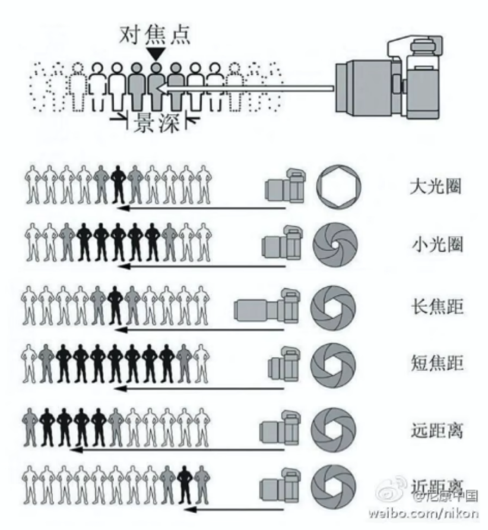

# 如何购买相机

## 相机的种类

- 单反相机：单镜头反光式取景相机。有反光镜，体积较大，镜头种类多，续航好。
- 无反相机（微单机）：无反光镜设计，镜头略贵，易用性高，未来的发展方向。
- 卡片机：不可更换镜头。

## 决定机身价格的因素

- 传感器尺寸
  - 价格
    - 半画幅（APS-C）：4000～9000¥
    - 全画幅：8000～25000¥
  - 相机参数评分查询：https://www.dxomark.com/Cameras/
- 方便程度
  - 屏幕、直出效果
    - 索尼的屏幕和菜单友好上，与佳能、尼康有差距
  - 对焦
    - 对于新机器的对焦性能都很好，老机器里索尼的对焦性能突出
  - 防抖
  - 体积和重量
- 镜头群

## 选择适合自己的相机

1. 确定预算
2. 搜集信息，做大致罗列
3. 列表格具体对比

## 镜头选择

### 焦距

全画幅下：

- 超广角：< 16mm
- 广角：16mm ~ 35mm
- 长焦：70mm ~ 100mm
- 超长焦：> 200mm

半画幅数字直接除以1.5：

- 超广角：< 10mm
- 广角：10mm ~ 23mm
- 长焦：46mm ~ 66mm
- 超长焦：> 133mm

变焦镜头和定焦镜头：

- 变焦镜头：方便
- 定焦镜头：光圈可以做的更大

### 镜头推荐

- 半画幅
  - 微单：14-15mm
  - 单反：18-55mm
  - 加预算：18-135mm
- 全画幅
  - 24-105f4
  - 24-70ƒ2.8（大三元）
  - 24-70f4（小三元）

### 焦段与透视的关系

所谓“压缩感”，实际上就是由透视关系造成的**近大远小**。长焦相比短焦拍摄时通常距离拍摄物体更远，因此看起来长焦拍摄具有压缩感，短焦镜头通过拉远距离放大裁切画面具有同样的效果，不过会损害画质。

### 景深

即画面中，清晰的深度。
影响景深的三个要素：

- 光圈
- 焦段
- 对焦距离

### 不同题材适合的常见镜头

只是常见的作为参考

- 人像：35-85mm，f1.4、f1.8
- 风光：广角或者长焦，163-5mm、70-200mm，f4、f2.8
- 扫街：35mm
- 产品：90mm
