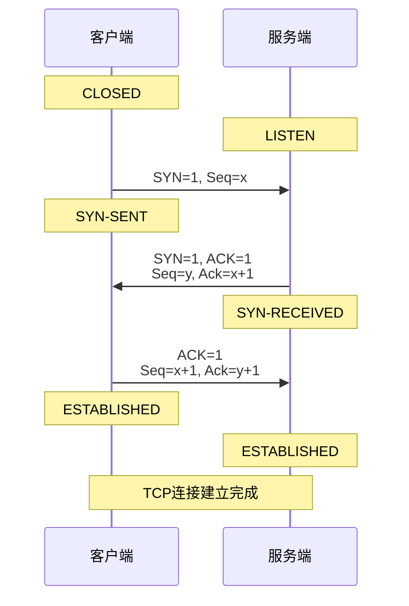

# TCP 传输控制协议

## 三次握手机制


::: details Q：为什么一定要是三次握手？

三次握手的本质是：防止历史请求干扰 + 双方确认收发能力 + 确认连接是“现在这一条”。

如果是两次：

```text
客户端发送SYN：我能发！
服务端发送ACK + SYN：我收到了，并且我能发！
```

此时确认了客户端**发送**能力和服务端**发送和接受**能力，客户端能否接收到服务端的ACK + SYN报文尚且未知。

此外，另一种情况是历史报文干扰。过去的一条SYN因为各种原因延迟了很久，在这期间客户端已经向服务端重新发送了一条新的连接，完成通信并且断开。之后服务端突然收到了这个延迟的连接请求，于是服务端回复ACK + SYN并建立连接，但这条过时的连接已经被客户端认为作废。

如果是四次：

```text
客户端发送SYN：我能发！
服务端发送ACK：我收到了！
服务端发送SYN：我能发！
客户端发送ACK：我也收到了！
```

四次可以建立连接，但是第2次和第3次完全可以合并，因为TCP是**全双工**的，服务端在回复“我收到了”（ACK）的同时，可以顺手说一句“我也准备好了”（SYN）。

:::

::: details Q：为什么SYN Flood能打爆服务器？

SYN Flood的实现原理即攻击者发送大量的SYN请求给服务器，但是之后不会再回复服务器的ACK + SYN，服务器收到SYN请求后会将每个SYN放入**半连接队列**（SYN queue），并对半连接队列中的每个SYN进行几次超时重传。

于是对服务器产生的影响包括：

1. 半连接队列被塞满，正常用户的SYN请求被丢弃
2. 内存被耗尽，每个半连接都包含了连接结构体，连接过大导致内存占用过高
3. CPU被耗尽，重传机制导致半连接队列中的每个SYN都要重发SYN+ACK若干次

:::

::: details Q：SYN Cookie是如何解决SYN Flood的？

SYN Cookie 通常是在半连接队列即将满的情况下启用。SYN Cookie 是收到SYN请求后，不再给SYN分配任何资源，而是将状态信息（客户端信息、服务端信息、时间戳、哈希签名、 MSS等参数）编码后塞入seq序列号中发送给客户端，等客户端回复服务器后，通过客户端回复的seq+1，推算出刚才的cookie，完成校验后才会分配资源+建立连接。

缺点：

- 服务器只能编码八种 MSS 数值，因为只有 3 位二进制空间可用
- 服务器必须拒绝所有的TCP选用项，例如大型窗口和时间戳，因为服务器会在信息被用其他方式存储时丢弃 SYN 队列条目

:::